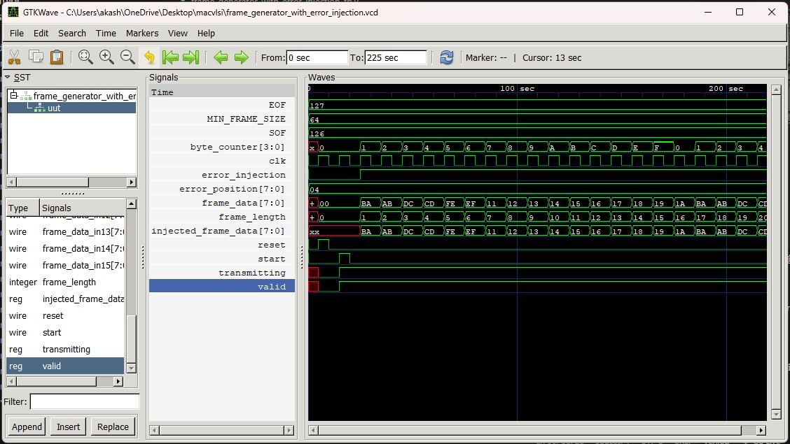

# MAC Frame Generator 
Designing a Robust Ethernet Frame Generator with Error Handling and Control Mechanisms using Verilog with Icarus Verilog and GTKWave


## Introduction
This project is a **MAC Frame Generator** designed to simulate Ethernet frame creation, including error detection and injection functionalities. It generates frames with various enhancements such as CRC, parity, flow control, and more, allowing for comprehensive testing and validation of Ethernet communication. The project is implemented in **Verilog** and aims to provide a detailed, modular approach to frame generation and error handling.

## Novelty
- Simulates Ethernet frame generation with various features like CRC, parity, flow control, and error detection.
- Supports error injection for simulating transmission issues and testing error detection mechanisms.
- Modular design with separate modules for different frame types and error handling strategies.
- Provides a comprehensive testbench to verify frame generation and error detection.
  
## Project Format Tree
```
macvlsi/
├── frame_generator.v
├── frame_generator_tb.v
├── frame_generator_tb.vcd
├── frame_generator_tb.out
├── frame_gen_with_flow_control.vcd
├── frame_generator_with_error_injection.v
├── frame_generator_with_error_injection.vcd
├── frame_generator_with_error_injection_tb.v
├── frame_generator_with_flow_control.v
├── frame_generator_with_flow_control_tb.out
├── frame_generator_with_flow_control_tb.v
├── frame_generator_with_padding.v
├── frame_generator_with_padding.vcd
├── frame_generator_with_padding_tb.out
├── frame_generator_with_padding_tb.v
├── frame_generator_with_parity.v
├── frame_generator_with_parity_tb.out
├── frame_generator_with_parity_tb.v
├── frame_generator_with_parity_tb.vcd
├── frame_generator_with_sync.v
├── frame_generator_with_sync_tb.out
├── frame_generator_with_sync_tb.v
├── frame_generator_with_sync_tb.vcd
├── frame_receiver.v
├── frame_receiver_tb.out
├── frame_receiver_tb.v
├── frame_receiver_tb.vcd
├── dump.vcd
├── test.out
├── Screenshots/
│   ├── Output1.jpg
│   ├── Output2.jpg
│   ├── Output3.jpg
│   ├── Output4.jpg
│   ├── Output5.jpg
│   ├── Output6.jpg
│   ├── Output7.jpg
│   ├── Output8.jpg
├── README.md
```

---

### Frame Generator
- **Description**: Generates Ethernet frames without CRC. It takes a set of input data bytes and creates a frame in the standard Ethernet format.
- **Commands to run**: 
  - Run synthesis and simulation using `Icarus Verilog`:
    ```
    iverilog -o frame_gen_tb.vvp frame_generator.v tb_frame_generator.v
    vvp frame_gen_tb.vvp
    ```
- **Inputs**: A set of 16 bytes of frame data.
- **Outputs**: Ethernet frame, with a valid signal indicating when a frame is ready.


---

### Frame Generator with CRC
- **Description**: This frame generator includes the ability to compute and append a **Cyclic Redundancy Check (CRC)** for error detection. It takes in a frame and computes its CRC.
- **Commands to run**: 
  - Run synthesis and simulation using `Icarus Verilog`:
    ```
    iverilog -o frame_gen_crc_tb.vvp frame_generator_crc.v tb_frame_generator.v
    vvp frame_gen_crc_tb.vvp
    ```
- **Inputs**: A set of 16 bytes of frame data.
- **Outputs**: Ethernet frame with the CRC appended at the end.

  

---

### Frame Receiver
- **Description**: The frame receiver module is designed to receive Ethernet frames, extract data, and check the CRC for error detection. It verifies if the frame is correctly received by comparing the transmitted CRC.
- **Commands to run**: 
  - Run synthesis and simulation using `Icarus Verilog`:
    ```
    iverilog -o frame_receiver_tb.vvp frame_receiver.v tb_frame_receiver.v
    vvp frame_receiver_tb.vvp
    ```
- **Inputs**: A complete Ethernet frame with CRC.
- **Outputs**: Extracted data and a signal indicating if there was a CRC error.


  

---

### Frame Generator with Parity Bit
- **Description**: This generator adds a **parity bit** to each byte of the frame for error detection. It ensures that the number of 1's in each byte is even (even parity).
- **Commands to run**: 
  - Run synthesis and simulation using `Icarus Verilog`:
    ```
    iverilog -o frame_gen_parity_tb.vvp frame_generator_parity.v tb_frame_parity.v
    vvp frame_gen_parity_tb.vvp
    ```
- **Inputs**: A set of 16 bytes of frame data.
- **Outputs**: Ethernet frame with a parity bit for each byte.


  

---

### Frame Generator with Synchronization (Start and Stop Bit)
- **Description**: This generator implements **synchronization** by adding a **Start Bit** and **Stop Bit** to the frame. This helps with frame alignment and ensures proper communication between sender and receiver.
- **Commands to run**: 
  - Run synthesis and simulation using `Icarus Verilog`:
    ```
    iverilog -o frame_gen_sync_tb.vvp frame_generator_sync.v tb_frame_sync.v
    vvp frame_gen_sync_tb.vvp
    ```
- **Inputs**: A set of 16 bytes of frame data.
- **Outputs**: Ethernet frame with Start and Stop bits added for synchronization.


  

---

### Frame Generator with Flow Control
- **Description**: This frame generator adds **Flow Control** signals, simulating backpressure or ready/busy signals. This helps test communication in congested network scenarios.
- **Commands to run**: 
  - Run synthesis and simulation using `Icarus Verilog`:
    ```
    iverilog -o frame_gen_flow_tb.vvp frame_generator_flow.v tb_frame_flow.v
    vvp frame_gen_flow_tb.vvp
    ```
- **Inputs**: A set of 16 bytes of frame data.
- **Outputs**: Ethernet frame with flow control signals indicating whether the receiver is ready to accept more data.


  

---

### Frame Generator with Padding
- **Description**: This generator ensures that frames meet the **minimum Ethernet frame size** (64 bytes) by adding **padding** if the frame is smaller than 64 bytes.
- **Commands to run**: 
  - Run synthesis and simulation using `Icarus Verilog`:
    ```
    iverilog -o frame_gen_padding_tb.vvp frame_generator_padding.v tb_frame_padding.v
    vvp frame_gen_padding_tb.vvp
    ```
- **Inputs**: A set of 16 bytes of frame data.
- **Outputs**: Ethernet frame, with padding added if necessary to meet the minimum size.


  

---

### Frame Generator with Error Injection
- **Description**: This generator can **inject errors** into the data field or CRC, simulating transmission errors and enabling error detection during transmission.
- **Commands to run**: 
  - Run synthesis and simulation using `Icarus Verilog`:
    ```
    iverilog -o frame_gen_error_tb.vvp frame_generator_error.v tb_frame_error.v
    vvp frame_gen_error_tb.vvp
    ```
- **Inputs**: A set of 16 bytes of frame data and an error injection signal.
- **Outputs**: Ethernet frame with error injected at a specified bit position.


  

---

## Contact Information

**Akash S**  
*Hardware Expert*

- Website: [www.akashn.com](http://www.akashn.com)
- Mail: [akashsweb@gmail.com](mailto:akashsweb@gmail.com)

---


